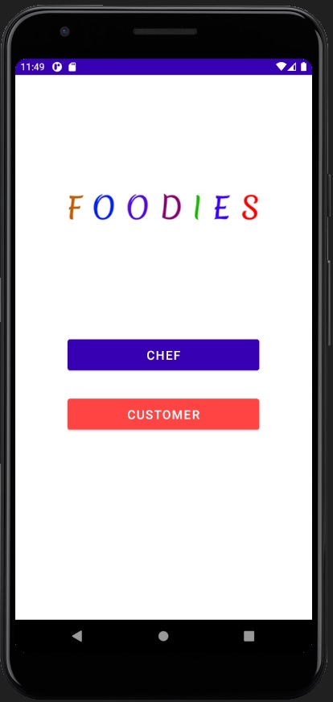
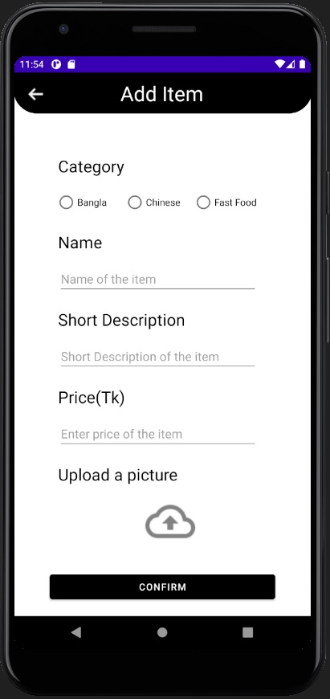
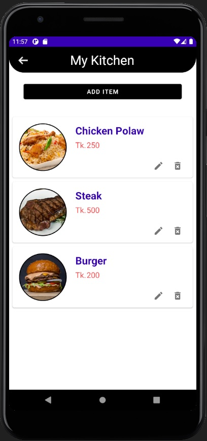
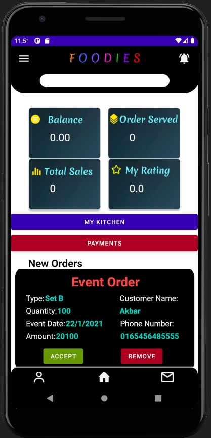
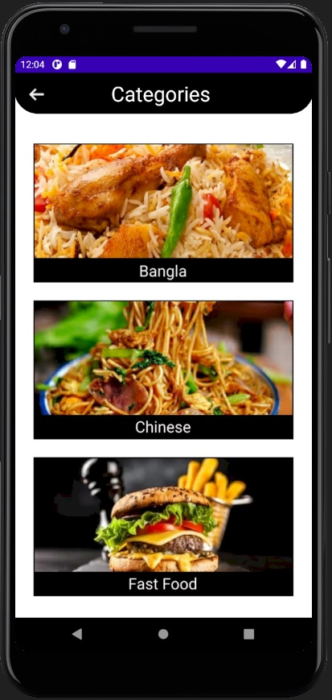
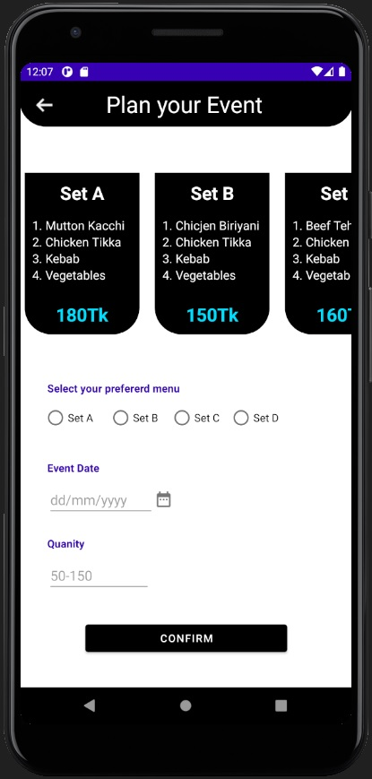
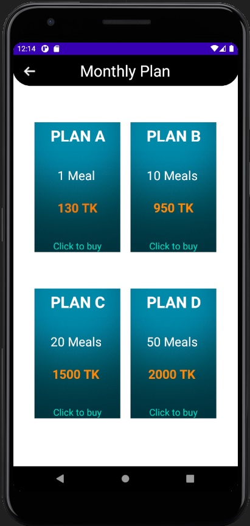
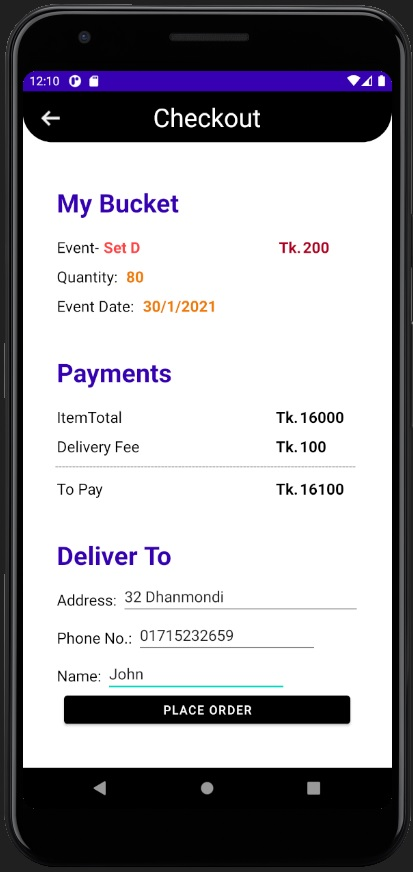

# Project Name: FOODIES (A Homemade Food Delivery App)

> Name: A.K.M.Jubair Ahmed

> ID: 1631398042

> Course code: CSE486.1

> Fall-2020

  

---

### Table of Contents

- [Introduction](#introduction)
- [App Features](#app-features)
- [Data Management](#data-management)
- [Roadblocks](#roadblocks)

  

---

## Introduction

This app provides services for the people who prefers homemade foods rather than food from restaurants. The app usually connects the customers with homemade chefs.
This app can be helpful for the people especially who are bachelors or office goers as they can set up monthly plan according to their needs. Besides, for any sort of events, people dont need to worry regarding the preparation of food rather they can take help from this app to pre-order the items and get delivered on the event day. 

  

---

## App Features

The app is designed for two distinct users- one is chef and another is customer. For both users, essential features are developed and integrated in the app. The features are explained below:

 

- #### Features in Chef's Account

1. Chefs can add food items to their kitchen/store. For adding an item, all they need is to fill up a form and submit. The form contains food name, description, price and an option to upload the picture of the particular food. After submit, the information of the item is stored in database.  

 

2. Chefs can view their own food items in their kitchen once they add the items. The food items are presented in cardview in RecyclerView. They can also update or delete any food item whenever they want.

 

3. Chefs are able to view customers' orders in their homepage. The orders are presented on a CardView in RecycleView. In the order, chef can see customer's name, address, contact number and type of order including the total quantity and price. After seeing the orders, they can either accept or reject according to their preference. When a chef accept an order, notification is sent to customer which states order accepted confirmation message.  

 

4. There are some other features which will be integrated in this app later. Other features contains a secured payment system where chef can redeem balance from their wallet using Bkash. Integration of google map which will help the chefs to track customers' location. 
  
    

- #### Features in Customer's Account

1. Customer can explore food items according to their preference. There are three categories: Bangla, Chinese and FastFood.   

 

2. Customers can make plans for their Event. The event page contains different type of set menus. Customers can view the menus and select whichever they need, then they need to enter the quantity and specify the event date which the help the chefs to prepare and deliver on the event day. 

 

3. Customers those who are bachelors can set up Monthly Plan. Monthly plan includes several menus and the price are set in a variety range.

 

4. After any order, customers are taken to checkout page where they can view the their bucket which shows what they have ordered and the total payments that they need to pay. After placing an order, the customer redirects to Confirmation page.

 

5. Other features contains Plan for Office Meal which will be used helpful for the office-goers, a secured payment system using which customers can add balance from wallet using Bkash. Google map integration to see chef's location.

  

---

## Data Management

For the management of the data, Firebase Cloud Firestore has been used which is a NoSQL database. Cloud Firestore is Firebase’s newest flagship database for mobile apps which is richer, faster, and more scalable than the Realtime Database.

Cloud Firestore stores data in documents arranged in collections. Simple data is stored in documents, which is easy and similar to the way data is stored in JSON. Complex, hierarchical data is conveniently organized at scale using subcollections within documents. Cloud Firestore requires less denormalization and data flattening.

For this app, no local storage has been used but it can be integrated later.

  

---

## Roadblocks

While working with the application, there were some roadblocks which slowed down the rate of work. However, the problems were solved gradually and were able to move forward. The roadblocks contains browsing images from mobile device and upload to firebase storage. The link of the image which is stored in the storage needs to be sent to cloud firestore. This took a lot of time and lastly it was solved using 'Glide' library. 

Second roadblock was to fetch information from cloud firestore and to display in the CardView. At first, the data was not shown displayed correctly. This occurred because some of the model constructors was not matching with the Adapter's function.

There was another problem which was the constant crashing of app during runtime. Later, the emulator was re-installed and then the problem was solved.

  

---

